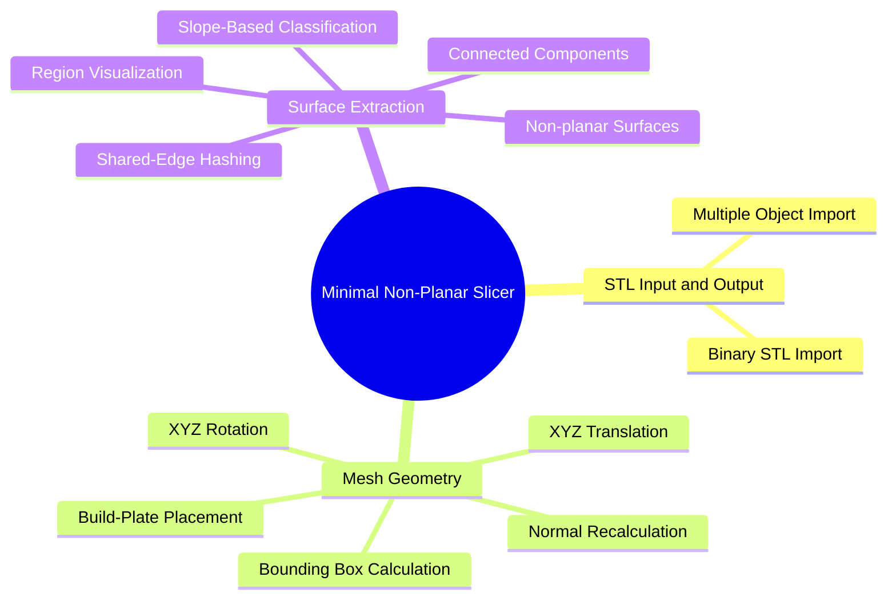

# Minimal Non-Planar Slicer

A browser-based experimental non-planar slicer.


## Demo

[Open the browser demo](https://coding-mechanism.github.io/minimalNonPlanarSlicer/)

##

The current implementation can:

* load binary STL models
* position and rotate multiple models
* recalculate transformed triangle normals
* select upward-facing triangles using a configurable slope limit
* divide selected triangles into connected surface regions
* inspect objects and extracted surfaces in an interactive browser interface

Toolpaths and Gcode export in the near future. Nozzle collision avoidance will be left as an exercise for the user, not planning on implementing anything like path rerouting in the future. Possibly a rudimentary hotend assembly included angle check; a binary go/ no-go.


<a id="implementation-map"></a>

## Current Implementation



---

# Current Processing Pipeline

The implemented surface-extraction pipeline is:

1. Load a binary STL model.
2. Parse its triangles, vertices, and supplied normals.
3. Preserve original geometry and create a working copy.
4. Move geometry above the build plate when necessary.
5. Apply object translation and rotation.
6. Recalculate triangle normals.
7. Select upward-facing triangles using the object's maximum slope angle.
8. Hash triangle vertices and edges.
9. Traverse triangles connected through shared edges.
10. Convert each connected component into a surface-region object.
11. Add the generated regions beneath the source object in the sidebar.
12. Draw the object and its regions in the viewport.

---

# Repository Structure

```text
minimalNonPlanarSlicer/
├── index.html
├── state.js
├── computation.js
├── ui.js
├── pedalTopCoverNonPlanarExperiment.stl
└── README.md
```

## `computation.js`

Contains the geometry and viewport operations, including:

* STL file loading
* bounding-box calculation
* mesh translation
* mesh rotation
* normal recalculation
* top-facing triangle selection
* shared-edge hashing
* connected-component extraction
* surface creation
* STL serialization
* canvas rendering

## `state.js`

Contains the primary data structures and application state, including:

* STL objects
* surface regions
* build-plate geometry
* object and region settings
* selected-node state
* machine configuration

## `ui.js`

Contains the interface controller, including:

* object and region tree rendering
* editor rendering
* node selection
* context menus
* visibility, locking, and deletion
* panel state
* viewport zoom
* canvas drawing
* input delegation

## `index.html`

Contains the application layout, styling, controls, panels, drawers, menus, and canvas workspace.


---

# Implementation index

**STL input and output:**
[Binary STL Import](#binary-stl-import) ·
[Multiple Object Import](#multiple-object-import) ·
[Bundled Demo Model](#bundled-demo-model) ·
[Binary STL Serialization](#binary-stl-serialization)

**Mesh geometry:**
[Bounding Box Calculation](#bounding-box-calculation) ·
[XYZ Translation](#xyz-translation) ·
[XYZ Rotation](#xyz-rotation) ·
[Normal Recalculation](#normal-recalculation) ·
[Build-Plate Placement](#build-plate-placement) ·
[Triangle Data Copying](#triangle-data-copying)

**Surface extraction:**
[Slope-Based Classification](#slope-based-classification) ·
[Shared-Edge Hashing](#shared-edge-hashing) ·
[Connected Components](#connected-components) ·
[Surface Region Objects](#surface-region-objects) ·
[Region Visualization](#region-visualization)

**Browser workspace:**
[Build-Plate View](#build-plate-view) ·
[Viewport Rotation](#viewport-rotation) ·
[Viewport Zoom](#viewport-zoom) ·
[Object and Region Tree](#object-and-region-tree) ·
[Object and Region Selection](#object-and-region-selection) ·
[Visibility Controls](#visibility-controls) ·
[Lock Controls](#lock-controls) ·
[Object and Region Deletion](#object-and-region-deletion) ·
[Object and Surface Editor](#object-and-surface-editor) ·
[Collapsible Workspace Panels](#collapsible-workspace-panels)

---

# STL Input and Output

<a id="binary-stl-import"></a>

## Binary STL Import

* [x] Read STL files through the browser file API
* [x] Parse the binary STL triangle count
* [x] Parse triangle normal vectors
* [x] Parse all three vertices of each triangle
* [x] Preserve an original triangle collection
* [x] Create a separate working triangle collection
* [x] Store the source triangle index
* [x] Store the imported filename as the initial object name and identifier

[↑ Back to implementation map](#implementation-map)

---

<a id="multiple-object-import"></a>

## Multiple Object Import

* [x] Import multiple STL files from one file-selection event
* [x] Store imported models in an object map
* [x] Store objects and surface regions in a shared node map
* [x] Generate unique identifiers when duplicate filenames are imported
* [x] Select newly imported objects automatically
* [x] Display multiple visible objects in the viewport

[↑ Back to implementation map](#implementation-map)

---

<a id="bundled-demo-model"></a>

## Bundled Demo Model

* [x] Include a demonstration STL with the repository
* [x] Load the demonstration object into application state
* [x] Position the demonstration geometry relative to the configured build plate
* [x] Generate surface regions from the demonstration model
* [x] Select and display the loaded demonstration object

[↑ Back to implementation map](#implementation-map)

---

<a id="binary-stl-serialization"></a>

## Binary STL Serialization

* [x] Allocate a binary STL buffer from a triangle collection
* [x] Write the triangle count to the STL header
* [x] Write triangle normal components
* [x] Write triangle vertex coordinates
* [x] Create a downloadable STL blob
* [x] Trigger a browser file download

The repository contains binary STL serialization code. The current primary interface is still centered on geometry inspection rather than a complete export workflow.

[↑ Back to implementation map](#implementation-map)

---

# Mesh Geometry

<a id="bounding-box-calculation"></a>

## Bounding Box Calculation

* [x] Calculate minimum and maximum X coordinates
* [x] Calculate minimum and maximum Y coordinates
* [x] Calculate minimum and maximum Z coordinates
* [x] Return all eight bounding-box corner coordinates
* [x] Return a named minimum-and-maximum bounds object
* [x] Use bounds to calculate an object's geometric center

[↑ Back to implementation map](#implementation-map)

---

<a id="xyz-translation"></a>

## XYZ Translation

* [x] Translate every triangle vertex along X
* [x] Translate every triangle vertex along Y
* [x] Translate every triangle vertex along Z
* [x] Maintain per-object translation values
* [x] Apply object translations to extracted surface regions
* [x] Update geometry from editor input

[↑ Back to implementation map](#implementation-map)

---

<a id="xyz-rotation"></a>

## XYZ Rotation

* [x] Rotate points using sine and cosine
* [x] Rotate meshes around the X axis
* [x] Rotate meshes around the Y axis
* [x] Rotate meshes around the Z axis
* [x] Maintain per-object rotation values
* [x] Rotate geometry around its calculated center
* [x] Recompute extracted surface regions after object rotation changes

[↑ Back to implementation map](#implementation-map)

---

<a id="normal-recalculation"></a>

## Normal Recalculation

* [x] Calculate triangle edge vectors
* [x] Calculate triangle normals using a cross product
* [x] Normalize generated normal vectors
* [x] Recalculate normals for an entire triangle collection
* [x] Recalculate transformed object normals before surface classification
* [x] Create triangles with generated normals

[↑ Back to implementation map](#implementation-map)

---

<a id="build-plate-placement"></a>

## Build-Plate Placement

* [x] Find the minimum Z coordinate of an object
* [x] Move imported geometry upward when it begins below Z zero
* [x] Support automatic minimum-Z placement
* [x] Position models relative to a corner-origin build plate
* [x] Position models relative to a centered build plate
* [x] Recalculate placement after object rotation

[↑ Back to implementation map](#implementation-map)

---

<a id="triangle-data-copying"></a>

## Triangle Data Copying

* [x] Deep-copy triangle vertex coordinates
* [x] Copy triangle normal vectors
* [x] Preserve original geometry separately from transformed geometry
* [x] Create independent geometry collections for extracted surface regions
* [x] Use copied data to avoid directly modifying source triangles during display transforms

[↑ Back to implementation map](#implementation-map)

---

# Surface Extraction

<a id="slope-based-classification"></a>

## Slope-Based Classification

* [x] Classify triangles using the Z component of their normal
* [x] Convert a maximum slope angle into a normal threshold
* [x] Extract triangles meeting the configured upward-facing threshold
* [x] Store a maximum slope angle for each object
* [x] Re-run classification when the slope setting changes
* [x] Re-run classification when object orientation changes

[↑ Back to implementation map](#implementation-map)

---

<a id="shared-edge-hashing"></a>

## Shared-Edge Hashing

* [x] Generate deterministic hashes for triangle vertices
* [x] Generate deterministic hashes for triangle edges
* [x] Normalize edge endpoint order before hashing
* [x] Build an edge map from selected triangles
* [x] Associate shared edges with their adjacent triangles
* [x] Distinguish boundary edges from two-triangle shared edges

[↑ Back to implementation map](#implementation-map)

---

<a id="connected-components"></a>

## Connected Components

* [x] Traverse selected triangles through shared edges
* [x] Track discovered edges during traversal
* [x] Track discovered triangles during traversal
* [x] Separate disconnected triangle groups
* [x] Handle components beginning from boundary edges
* [x] Handle components containing only closed shared-edge connectivity
* [x] Return each connected group as an independent triangle collection

[↑ Back to implementation map](#implementation-map)

---

<a id="surface-region-objects"></a>

## Surface Region Objects

* [x] Convert connected triangle groups into surface-region objects
* [x] Associate each region with its parent STL object
* [x] Assign region identifiers and names
* [x] Record the number of triangles in each region
* [x] Store independent original and working triangle collections
* [x] Store region visibility and lock state
* [x] Store region print-mode and material-setting fields
* [x] Store a non-planar Z offset
* [x] Register generated regions in the application's node map
* [x] Regenerate child regions when object geometry or slope settings change

[↑ Back to implementation map](#implementation-map)

---

<a id="region-visualization"></a>

## Region Visualization

* [x] Draw extracted regions as filled triangles
* [x] Draw region edges separately from region fills
* [x] Highlight the selected object's regions
* [x] Highlight the selected region separately from sibling regions
* [x] Display regions belonging to unselected objects
* [x] Apply object translation to region geometry
* [x] Apply the non-planar Z offset to region geometry
* [x] Apply viewport rotation to region geometry

[↑ Back to implementation map](#implementation-map)

---

# Browser Workspace

<a id="build-plate-view"></a>

## Build-Plate View

* [x] Represent the build plate with configurable length, width, and height values
* [x] Generate build-plate edge segments
* [x] Translate the build plate around its orbit center
* [x] Rotate build-plate geometry for display
* [x] Draw the build plate on a canvas
* [x] Scale the plate to the available viewport
* [x] Support corner and centered origin modes

[↑ Back to implementation map](#implementation-map)

---

<a id="viewport-rotation"></a>

## Viewport Rotation

* [x] Store viewport rotation angles
* [x] Rotate the build-plate projection
* [x] Rotate visible object geometry
* [x] Rotate extracted surface geometry
* [x] Support mouse-drag view rotation
* [x] Redraw the scene after rotation changes

[↑ Back to implementation map](#implementation-map)

---

<a id="viewport-zoom"></a>

## Viewport Zoom

* [x] Maintain a viewport scale factor
* [x] Zoom in through the interface
* [x] Zoom out through the interface
* [x] Reset the viewport zoom
* [x] Redraw geometry at the updated scale
* [x] Display the current zoom multiplier

[↑ Back to implementation map](#implementation-map)

---

<a id="object-and-region-tree"></a>

## Object and Region Tree

* [x] Display imported STL objects in a sidebar tree
* [x] Display generated surface regions beneath their parent objects
* [x] Expand and collapse object children
* [x] Display object names and descriptions
* [x] Display region names and descriptions
* [x] Highlight the currently selected tree node
* [x] Re-render the tree after geometry changes

[↑ Back to implementation map](#implementation-map)

---

<a id="object-and-region-selection"></a>

## Object and Region Selection

* [x] Select objects from the sidebar
* [x] Select extracted surface regions
* [x] Maintain a shared selected-node identifier
* [x] Switch the editor context between object and surface settings
* [x] Highlight selected geometry in the viewport
* [x] Display the selected object's or region's name in the editor
* [x] Automatically select newly imported objects

[↑ Back to implementation map](#implementation-map)

---

<a id="visibility-controls"></a>

## Visibility Controls

* [x] Store visibility independently for objects and regions
* [x] Hide objects through the sidebar context menu
* [x] Show hidden objects through the sidebar context menu
* [x] Exclude hidden objects from viewport drawing
* [x] Redraw the viewport after visibility changes

[↑ Back to implementation map](#implementation-map)

---

<a id="lock-controls"></a>

## Lock Controls

* [x] Store a lock state for objects
* [x] Store a lock state for regions
* [x] Lock nodes through the sidebar context menu
* [x] Unlock nodes through the sidebar context menu
* [x] Display locked state in sidebar metadata

[↑ Back to implementation map](#implementation-map)

---

<a id="object-and-region-deletion"></a>

## Object and Region Deletion

* [x] Delete complete STL objects
* [x] Delete individual extracted surface regions
* [x] Remove deleted nodes from application state
* [x] Remove deleted regions from their parent's child collection
* [x] Update selection when the selected node is removed
* [x] Re-render the sidebar after deletion

[↑ Back to implementation map](#implementation-map)

---

<a id="object-and-surface-editor"></a>

## Object and Surface Editor

* [x] Display different controls for objects and surface regions
* [x] Edit object position values
* [x] Edit object rotation values
* [x] Edit maximum slope angle
* [x] Edit automatic minimum-Z placement
* [x] Edit non-planar region offset values
* [x] Store object-level print and material settings
* [x] Store region-level print and material settings
* [x] Switch between positioning and surface-related editor tabs
* [x] Mark application state as modified after input changes
* [x] Drag the editor panel around the workspace
* [x] Hide and restore the editor panel

[↑ Back to implementation map](#implementation-map)

---

<a id="collapsible-workspace-panels"></a>

## Collapsible Workspace Panels

* [x] Collapse and restore the object sidebar
* [x] Open and close the settings drawer
* [x] Open and close the machine drawer
* [x] Collapse and restore the development panel
* [x] Collapse and restore the preview panel
* [x] Synchronize panel state through shared application state
* [x] Preserve the central viewport while auxiliary panels change

[↑ Back to implementation map](#implementation-map)


