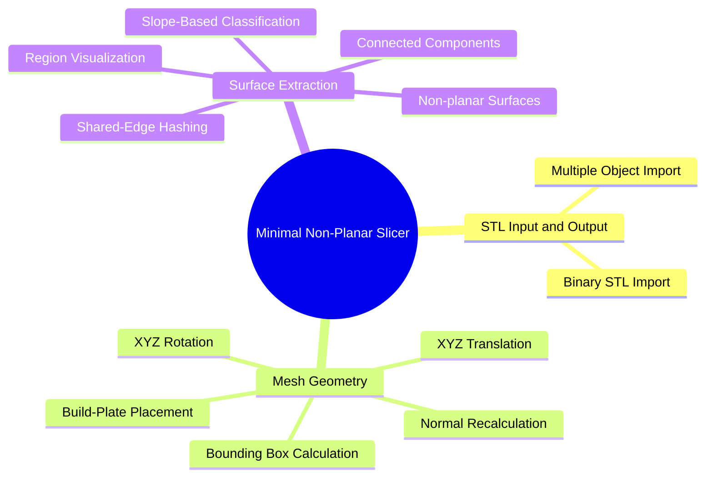

# Minimal Non-Planar Slicer

A browser-based non-planar slicer.
All files are processed locally, they never leave your machine.
Written from scratch in vanilla JS, no external dependencies to potentially ruin your day.

## Demo

[Open the browser demo](https://coding-mechanism.github.io/minimalNonPlanarSlicer/)

## Why Non-planar slicing?

Current 3D printer slicing software create weaknesses in the parts they produce, inherent within the slicing methodology. Non-planar slicing can potentially offer strength increases in the double digit percent on many geometries, out of the box. Applied to all 3D printed parts, that could be considerable decreases in time, money, and plastic waste! The approximate strength increase (non-planar : planar) for an arbitrary printed part in tension can be roughly calculated within the slicing process itself, without needing extensive destructive testing.

## What is a 3D printer slicing software?

A conventional 3D printer slicer takes arbitrary 3D models and cuts them into vertically stacked layers which approximates the 3D model. This involves finding intersections the 3D models make with 2D planes at regular intervals along the Z axis. This approach is effective, however, a well known issue is that this method introduces structural weaknesses within the part, where the flat layers can separate - this is called layer delamination/ separation. Non-planar slicing aims to address this weakness.

## What is non-planar slicing?

Non-planar slicing is still an open problem in known 3D printing research. The idea is that the nozzle follows toolpaths that vary in x, y, and z, effectively creating surfaces that vary in z. Some methods involve transforming the 3D model, slicing conventionally, then reverse transforming the resulting paths. Some methods involve a 4th axis which allows the nozzle to reach more effective extrusion positions. Currently there isn't a method that handles arbitrary meshes well, while having the potential expressiveness of conventional slicing. This custom non-planar approach aims to help in this regard.
##

The current implementation can:

* load binary STL files
* position and rotate multiple 3D models
* recalculate transformed triangle normal vectors
* select upward-facing triangles (normal vector z component >=0) using a configurable slope/ angle threshold.
* separate resulting triangles into connected component surfaces

Toolpaths and Gcode export in the near future. Nozzle collision avoidance will be left as an exercise for the user, not planning on implementing anything like path rerouting in the future. Possibly a rudimentary hotend assembly included angle check; a binary go/ no-go.

## Current Implementation

---

# Current Processing Pipeline

The implemented surface-extraction pipeline is:

1. Load a binary STL model.
2. Parse its triangles, vertices, and supplied normals.
3. Preserve original geometry and create a working copy.
4. Move geometry above the build plate when necessary.
5. Apply object translation and rotation.
6. Recalculate triangle normals.
7. Select upward-facing triangles using the object's maximum slope angle.
8. Hash triangle vertices and edges.
9. Traverse triangles connected through shared edges.
10. Convert each connected component into a surface-region object.
11. Add the generated regions beneath the source object in the sidebar.
12. Draw the object and its regions in the viewport.

